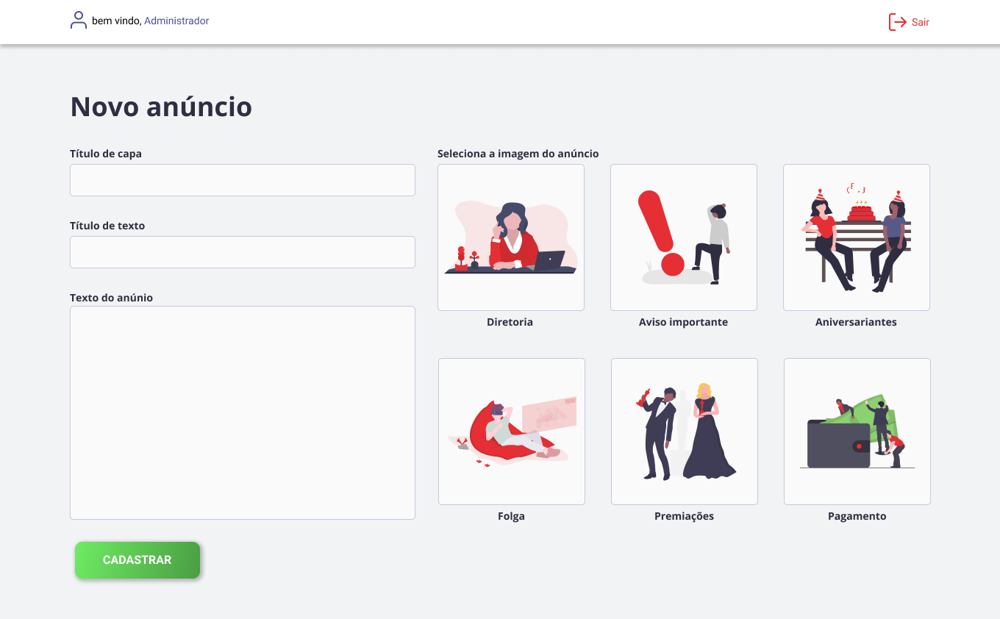

<h1 align="center">
        
    Node.js | React JS | MySQL
</h1>

  
   
    

 

  

## :bookmark: O problema

Na Rally Motos importora e distribuidora, os avisos são colocados em um quadro que fica localizado próximo a entrada do
estabelecimento, o intuíto é de que todos vissem os avisos do RH e Diretória da empresa assim que entrassem, mas não é
o que acontece. Muitos na correria do dia nem se quer olham para os avisos, o que por sua vez pode vir a causar ruídos
na comunicação empresa - funcionário.

 

## :bulb: A idéia

Estamos na era da informação as pessoas comumente olham as redes sóciais e sites em busca de informações, serviços e 
produtos. Os anúncios são um tipo de informação, logo, porquê não criar uma página da própria empresa para disponibilizar
esses anúncios online, assim todos poderiam compartilhar o link e transmitir a mensagem mais rápido do que conversando 
uns com os outros.

 

## :computer: Tenologias Utilizadas

Este projeto não é nada muito complexo, dentre as tecnologias utilizadas estão:
 

- [Node.js](https://nodejs.org/en/)
- [ReactJS](https://pt-br.reactjs.org/)
- [Figma](https://www.figma.com/)
- [Express](https://expressjs.com/pt-br/)
- [ESLint](https://eslint.org/)
- [Prettier](https://prettier.io/)

 

## :sparkles: Protótipo do site
 

A interface foi elaborada por mim [EddyPBR](https://github.com/EddyPBR/) utilizando a plataforma FIGMA, para acessar o 
projeto e ver o protótipo de interface basta acessar este 
[Link](https://www.figma.com/file/GjoZ01qEHzgckLer6Wp5jt/Mural-Digital?node-id=0%3A1) e aproveite.

  
  
  
  
  
  

 

 

## :memo: License

Este projeto esta sob a [MIT license](LICENSE) for more details
 

## :wave: Social

Siga EddyPBR nas redes :wink:
 

- [Instagram](https://www.instagram.com/edvaldo_junior_dev/)
- [LinkedIn](https://www.linkedin.com/in/edvaldojuniordev/)

 

Siga a Rally Motos nas redes
 

- [Instagram](https://www.instagram.com/rallymotosdist/?hl=pt-br)
- [facebook](https://pt-br.facebook.com/rallymotosdist/)
- [Ecommerce](https://www.rallymotos.com.br/)
