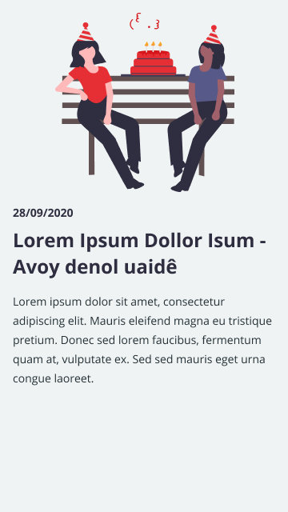

 
<h1> APP - Mural digital </h1>
 

## Tecnologias usadas

- [React Native](https://pt-br.reactjs.org/)
- [Expo](https://reactrouter.com/)
- [React Native Vector Icons](https://github.com/oblador/react-native-vector-icons)
- [React Native Animated Spinkit](https://www.npmjs.com/package/react-native-animated-spinkit)
- [Expo svg URI](https://www.npmjs.com/package/expo-svg-uri)
- [Styled Components](https://styled-components.com/)
- [Typescript](https://www.typescriptlang.org/)
  
 

## Como executar o projeto

A priori você deve ter a API (server) configurado e em execução. Dito isso, você deve configurar o arquivo 
.env deste projeto clique [aqui](./.env). Você deve definir as seguintes informaçẽos: 

- HOST=`<IP do servidor da api>`
- PORT=`<PORT do servidor da api>`
- APP_KEY=` `
 

Agora entre no diretório onde este arquivo README.md esta localizado, abra o terminal e execute 
a lista de comandos a seguir:

- yarn ou npm
- yarn expo start ou expo start

 
Observe a saida no terminal para verificar se o sistema esta rodando perfeitamente.

 
 

## Telas
 

#### HOME

`HOME`

  

 

#### MURAL

`MURAL`

  

 

#### ANUNCIO

`ANUNCIO`

  

 
 
