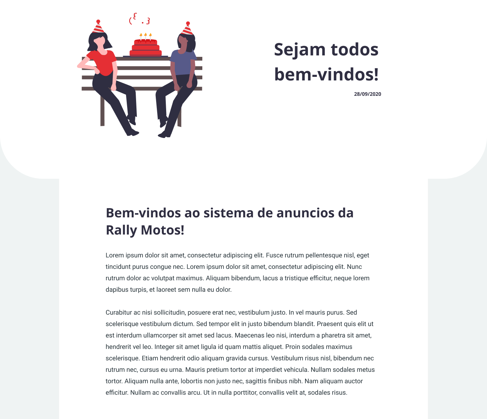

 
<h1> Frontend - Mural digital </h1>
 

## Tecnologias usadas

- [ReactJS](https://pt-br.reactjs.org/)
- [React Router](https://reactrouter.com/)
- [React Icons](https://react-icons.github.io/react-icons/)
- [React Spinners](https://www.davidhu.io/react-spinners/)
- [Styled Components](https://styled-components.com/)
- [Typescript](https://www.typescriptlang.org/)
  
 

## Como rodar o projeto

A priori você deve ter a API (server) configurado e em execução. Dito isso, você deve configurar o arquivo 
.env deste projeto clique [aqui](./.env). Você deve definir as seguintes informaçẽos: 

- REACT_APP_HOST=`<IP do servidor da api>`
- REACT_APP_PORT=`<PORT do servidor da api>`
- REACT_APP_PREFIX=`<http ou https>`
- SKIP_PREFLIGHT_CHECK=`true`
 

Agora entre no diretório onde este arquivo README.md esta localizado, abra o terminal e execute 
a lista de comandos a seguir:

- yarn ou npm
- yarn start ou npx start

 
Observe a saida no terminal para verificar se o sistema esta rodando perfeitamente.

 
 

## Páginas
 

### Páginas sem autenticação

#### MURAL | HOME

`CAMINHO /`

  

 

#### ANUNCIO

`CAMINHO /announces/:id`

  

 
 

### Páginas com autenticação ativa

#### ADMIN

`CAMINHO /admin`

  

 

#### LISTA DE ANUNCIOS CADASTRADOS

`CAMINHO /admin/announces`

  

 

#### CADASTRAR ANUNCIO

`CAMINHO /admin/announces/add`

  

 

#### ATUALIZAR ANUNCIO

`CAMINHO /admin/announces/update`

  

 

#### REMOVER ANUNCIO (não possui rota, apenas um componente que faz a requisição à api)

`CAMINHO /admin/announces/delete`

  

 

## AUTENTICAÇÃO

A autenticação é feita ná página admin, assim que o usuario envia o formulário para a api
se estiver correto a api retorna um bearer token, o mesmo é salvo em armazenamento local
`session_storage`, enquanto o token estiver ativo, o usuario pode utilizar as rotas privadas
tranquilamente.
 
 
